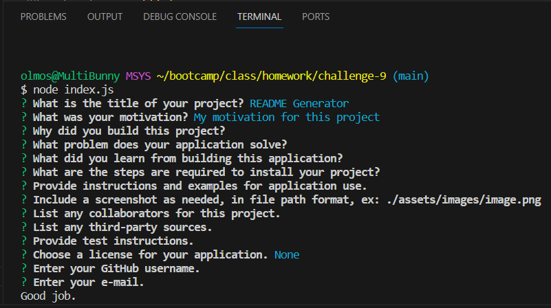

# README Generator

## Description

My motivation for this project is to create a functional README using nodejs and inquirer and capturing user input for creating the README file. I built this project so that it'll be easier to create a markdown file without having to look up the layout credentials of a professional README. This application solves the time consumption of having to create a README file for coders. I learned how useful the rest operator and template literals are.
    
## Table of Contents
    
-[Installation](#installation)
    
-[Usage](#usage)
    
-[Credits](#credits)
    
-[License](#license)
    
## Installation
    
There are no steps for installation.
    
## Usage
    
This project is only run by the terminal and using the node command. Running "node index.js" starts the questions needed for creating the layout of the README and finally, it creates the README file in the same diretory location as the index.js file.
    

    
## Credits
    
Collaborators: No collaborators.
    
Third-Party Assets: None.
    
## License

None
    
## Tests
    
Test instructions include running the "node index.js" command in the terminal and answering the questions set up and checking to see if all the questions run through correctly, user input is captured, and opening the code and preview for the generated README file.
    
## Questions
    
GitHub Profile: [cazthetraveler](https://github.com/cazthetraveler)
    
Reach me at my email: ldolmos.01@gmail.com